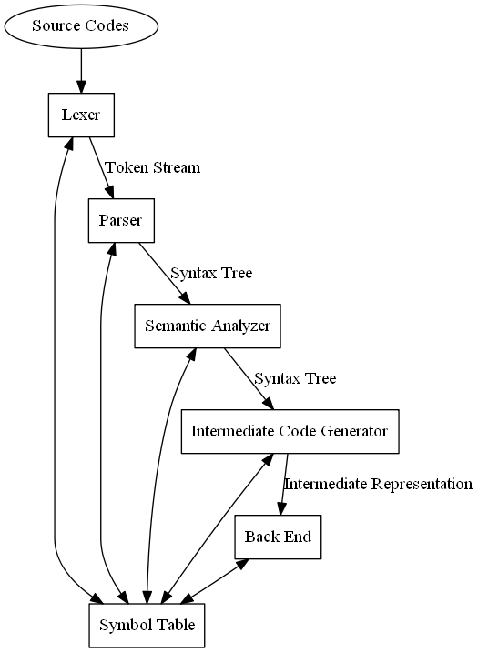

# Bazinga Compiler

This is a simple C++ compiler. I try to implement all functions that should be included in C++(basic grammars). The produce of this project will be a translator(C++), without back end.

## 1.Architecture

- **Symbol Table**:  Will be built in LR Parser.
- **Lexer**:  Arrange characters  from source codes(cpp files) and produce token stream.$Token:<token-name,token-type>$
- **LR Parser**: Integrating parsing, semantic analysis and intermediate code generating

## 2.Symbol Table

## 3.Lexer

​	For future expansion,  the Lexer reads regular definitions from txt(rd in project) files and generates a abstract syntax tree(AST). Based on AST, we will build a DFA directly from the AST we build before.

​	The Lexer use automata(DFA) to recognizes tokens. 

## 4.LR Parser(TODO)

​	Like Lexer, for future expansion, the LR Parser will read the grammars we define in txt(cfg) files and build LALR analyzer. Then, what we should do is implementing every semantic actions of every nonterminals, including shift actions and reduces.

​	So, we can regard type-check, attribute-calculating, intermediate-code-generating as semantic actions. As a result, Parser, Semantic Analyzer and Intermediate Code Generator are assembled in LR Parser.