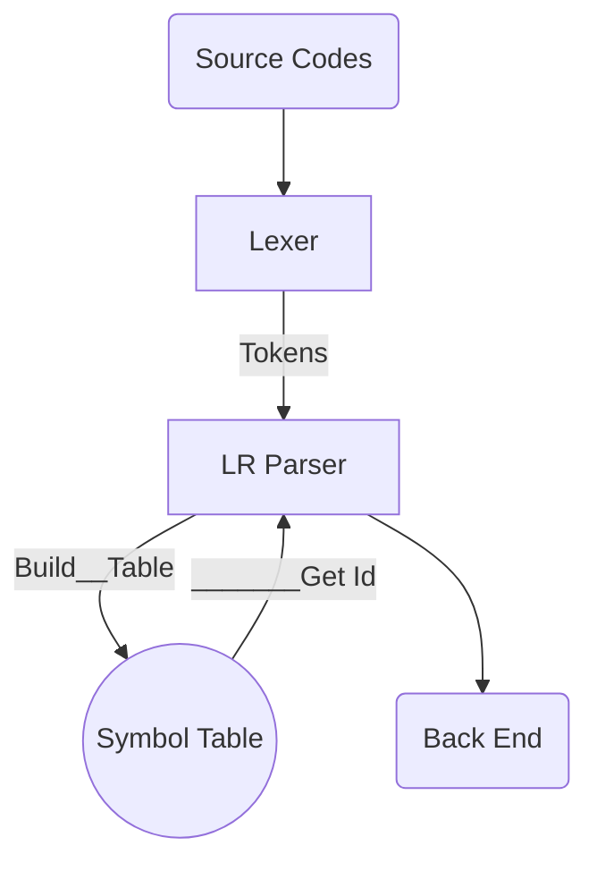

# Bazinga Compiler

​	This is a slow-to-die, single-function and fake-cpp compiler. Don't expect too much. Just for fun.

​	Congratulations! The first version is published. Here are the details.

## 1. Structure of Project 

## 2. Lexer

## 3. LR Parser

## 4. Symbol Tabel
